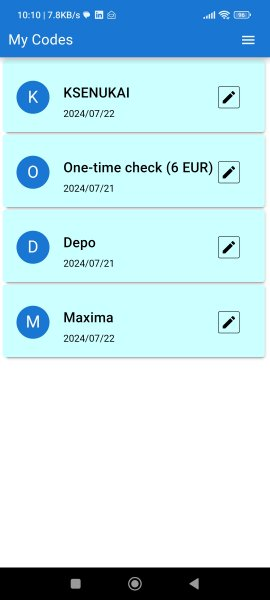
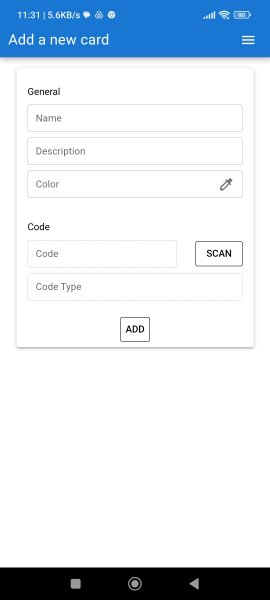
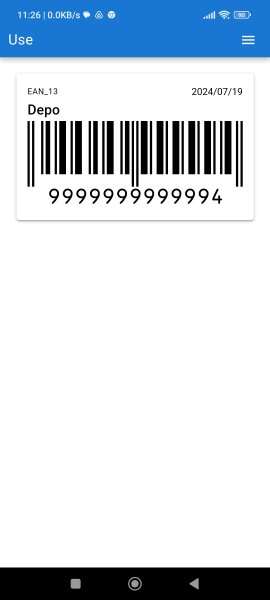

# Code Wallet

Code Wallet is a Progressive Web Application (PWA) that enables you to store and manage various codes (QR and barcodes)
directly on your mobile phone. All data is securely stored in your browser. We use
the "[html5-qrcode](https://github.com/mebjas/html5-qrcode)" library for
scanning codes and the "[bwip-js](https://github.com/metafloor/bwip-js)" library for displaying them. The application
interface is built using [Vue 3](https://vuejs.org/), [Vue
Router](https://router.vuejs.org/), and [Quasar](https://quasar.dev/), with component linking handled
by [@teqfw/di](https://github.com/teqfw/di).

Live instance: [https://wallet.wiredgeese.com/](https://wallet.wiredgeese.com/)

## The Main Task

Code Wallet aims to demonstrate the power of web technologies in creating mobile applications that rival native apps.
Key features include:

* Easily download and install Code Wallet directly from the website.
* Launch the application in full-screen mode for a seamless experience.
* Store the application in the browser cache to enable offline functionality.
* Keep user data secure in the browser's local storage (IndexedDB).
* Use your phone's camera to scan codes effortlessly.
* Display codes clearly on your phone screen.
* Collect geolocation data to track where individual cards are used.

## About Code Wallet

Code Wallet helps you digitize and organize your discount and loyalty card codes, as well as other types of barcodes and
QR codes. This app ensures that all your data remains on your device, with no data transferred to the backend.

Written in plain JavaScript with JSDoc for documentation, Code Wallet leverages a Dependency Injection-based
architecture for clean, maintainable code.

### Key Features

* Add and edit cards with barcode scanning entry.
* Access your cards offline and enjoy PWA installability.
* Collect geolocation data to track the use of individual cards.
* Store card data locally on your device.
* Use geolocation data to select cards based on your current location.
* Export and import your personal data with ease.

## Screenshots

### Home Page with List of Codes



### Form to Add a New Code



### Form to Use a Code



## TODO

* Enable manual entry of card details to support users who prefer not to scan.
* Organize cards with customizable tags.
* Implement version updates for the application.

## Install

To install and run Code Keeper locally, follow these steps:

1. **Clone the Repository**

   Clone the source code from the GitHub repository:

   ```bash
   git clone https://github.com/flancer64/pwa-wallet
   ```

2. **Build the Application**

   Navigate to the project directory and build the application using npm:

   ```bash
   cd pwa-wallet
   npm install
   ```

3. **Configure the Application**

   Copy the `./cfg/init.json` file to `./cfg/local.json`:

   ```bash
   cp ./cfg/init.json ./cfg/local.json
   ```

   Open ./cfg/local.json and set up the port and domain name if required.

4. **Run the Application**

   Start the application with npm:

   ```bash
   npm start
   ```

   Navigate to http://localhost:8082/ (or to your domain & port) to view the application.

5. **HTTPS Requirement**

   Note that the Service Worker (SW) requires HTTPS to function properly. For setting up HTTPS on your server, you can
   use [Certbot](https://certbot.eff.org/), which provides free SSL/TLS certificates.

By following these steps, you will be able to run Code Keeper on your local machine and test its features.

## Development Offer

Are you looking to develop a robust and user-friendly web application like Code Wallet? With over 20 hours of dedicated
development time, I have created a seamless PWA that showcases the capabilities of modern web technologies. Whether you
need a similar application or a completely different web solution, I can provide you with high-quality development
services tailored to your needs.

### What I Offer:

* Custom web application development
* Progressive Web Application (PWA) solutions
* Frontend development with Vue.js and Quasar
* Backend integration
* Dependency Injection (DI) architecture for clean, maintainable code
* Comprehensive documentation with JSDoc
* Geolocation and local storage functionalities
* Barcode and QR code integration

Contact me to discuss your project requirements and get a quote.
